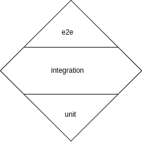

# Code standards

This Code standards guide describes the set of development guidelines followed in the signare.

The target audience of this document are developers and contributors.

The keywords “MUST”, “MUST NOT”, “REQUIRED”, “SHALL”, “SHALL NOT”, “SHOULD”, “SHOULD NOT”, “RECOMMENDED”, “MAY”, and “OPTIONAL” in this document are to be interpreted as described in [RFC 2119](https://datatracker.ietf.org/doc/html/rfc2119){:target="_blank"}.

## Local environment requirements

Besides Golang (please, refer to `app/go.mod` to check the current Golang version), the following tools are required to run the different Make targets:

| Tool                                                                         | Version |
|------------------------------------------------------------------------------|---------|
| [swagger-cli](https://www.npmjs.com/package/swagger-cli){:target="_blank"}   | 4.0.4   |
| [spectral](https://github.com/stoplightio/spectral){:target="_blank"}        | 6.11.1  |
| [gotestsum](https://github.com/gotestyourself/gotestsum){:target="_blank"}   | 1.11.0  |
| [golangci-lint](https://github.com/golangci/golangci-lint){:target="_blank"} | 1.54.2  |

## Code structure

At the higher level, the code is structured in two different modules:

* **app**: signare code itself.
* **deployment**: command to run and migrate the app.

The signare is structured following the [clean architecture](https://blog.cleancoder.com/uncle-bob/2012/08/13/the-clean-architecture.html){:target="_blank"} approach.

Diving deeper inside `app`, there are the following directories:

* **docs**: signare documentation along with the API specification.
* **include**: files that are embedded as part of the binary (like database schemas, database mappers, etc.).
* **pkg**: application code.
* **test**: test helpers.
* **tools**: utility tools used to generate application code and automate additional pipeline checks. 

Inside `app/pkg`, you can find the following directories:

* **adapters**: implementation of input/output ports as defined in clean architecture.
* **commons**: libraries used by the different application layers.
* **entities**: entities as defined in clean architecture.
* **graph**: builds the application graph injecting implementations for all the interfaces using [Wire](https://github.com/google/wire){:target="_blank"}.
* **internal**: code whose visibility is restricted to `app/pkg`.
* **signaturemanager**: defines the interface that needs to be satisfied by every HSM technology, along with its implementation for the different supported HSMs.
* **usecases**: use cases as defined in clean architecture.
* **utils**: utility functions (not libraries) used by the different application libraries.

Finally, the `deployment` module is composed by the following folders:

* **cmd**: signare CLI definition.
* **database**: utility scripts to provision databases for testing purposes.
* **examples**: configuration examples.

## Naming conventions

* When naming functions, the more specific the function, the more general its name SHOULD be. For example:
```
func Parse(filepath string) (Config, error) {
    switch fileExtension(filepath) {
        case "json":
            return parseJSON(filepath)
        case "yaml":
            return parseYAML(filepath)
        case "toml":
            return parseTOML(filepath)
        default:
            return Config{}, ErrUnknownFileExtension
    }
}
```

* Unlike functions, variables SHOULD be named from more to less specific the deeper we go into nested scopes.
```
func PrintBrandsInList(brands []BeerBrand) {
    for _, b := range brands {
        fmt.Println(b)
    }
}
```

## Errors

* Libraries MUST define their own errors.
* Infra packages MUST define their own errors.
* Adapters, use cases and entities MUST use pkg/internal errors.
* Use cases and entities MAY define human-readable messages when the developer considers it is needed. Other components that are not use cases nor entities MUST NOT define human-readable messages.
  * A linter rule will check if adapters define human-readable messages, throwing an error in those cases.

!!! note

    Internal and permission denied errors don't return the human-readable message through the API even if there's a defined one. They always return the same generic message.

## Code documentation

* All public variables and functions MUST be annotated following the [godoc guidelines](https://go.dev/blog/godoc){:target="_blank"}. Annotation comments SHOULD be at a high level of abstraction and concern the logical implementation of the code as little as possible.
* Command utilities described in a Makefile are RECOMMENDED to be documented why that utility was needed in the first place rather than explaining what the command does.
* When logging, messages MUST use lower case.
* Package level documentation is up to the developer depending on the complexity of the package. In case a package is documented, packages MUST be documented only in the file that is named as the package (following godoc guidelines). Example for a package named `errors`, the `errors.go` file would look like the following:
```
// Package errors defines...
package errors

// ...
```

## Patterns

### Organizing the code in a use case

Use cases code is organized using the following files:

* `<resource>_usecase.go`: defines the use case interface along with its implementation.
* `types.go`: contains the definition of the data structs used by the interface.
* The `<resource>_port.go` file, defines the interface implemented by adapters and all the types of this interface. For the specific case of an interface to a storage port, the file is named `<resource>_storage.go` instead.

The code in a `<resource>_usecase.go` file MUST divided into blocks. These block MUST be ordered as described below:
```
INTERFACE: defines the methods
IMPLEMENTATION: implements the methods
GUARD: guarding that the type below implements the INTERFACE
TYPE: the type implementing the INTERFACE
TYPE_PROVIDER: the method to create an instance of the TYPE
```

As an example, let's consider a resource named `Foo`. The `foo_usecase.go` would look like this:
```
type FooUseCase interface {
	CreateFoo(ctx context.Context, input CreateFooInput) (*CreateFooOutput, error)
}

func (u *DefaultUseCase) CreateFoo(ctx context.Context, input CreateFooInput) (*CreateFooOutput, error) {
  // implementation
}

var _ FooUseCase = (*DefaultUseCase)(nil)

type DefaultUseCase struct {
  // attributes
}

type DefaultUseCaseOptions struct {
  // constructor arguments
}

type ProvideDefaultUseCase(options DefaultUseCaseOptions) (*DefaultUseCase, error) {
  // constructor
}

```

Where the `types.go` defines the use case interface types:
```
type Foo struct {
  // Foo resource attributes here
} 

type CreateFooInput struct {
  // Input values to the CreateFoo function
}

type CreateFooOutput struct {
  Foo
}
```

In case we want to persist `Foo` resources in storage (a database for instance), the `foo_storage.go` can look like the following:
```
type FooStorage interface {
  Add(ctx context.Context, data Foo) (*Foo, error)
}
```

### Organizing the code in an adapter

If the interface is defined in another file, as is the case of the `<resource>_db_output_adapter.go` files, the block structure of the file won't define any interface and the guard will be on the top of the file:
```
GUARD: guarding that the type below implements the INTERFACE
IMPLEMENTATION: implements the methods
TYPE: the type implementing the INTERFACE
TYPE_PROVIDER: the method to create an instance of the TYPE 
```

Following the example from the previous section, the `foo_db_output_adapter.go` would look like this:
```
var _ foo.FooStorage = (*Repository)(nil)

// Add a Foo to the database
func (repository *Repository) Add(ctx context.Context, data foo.Foo) (*foo.Foo, error) {
	// implementation
}

type Repository struct {
	// arguments
}

type RepositoryOptions struct {
	// constructor arguments
}

func NewRepository(options RepositoryOptions) (*Repository, error) {
  // constructor
}
```

## Testing

The signare follows a diamond testing approach. If an application is typically composed by 3 layers of tests (unit, integration and e2e tests), a diamond testing approach has some unit tests, many integration tests, and also some e2e tests. This is the opposite of the traditional pyramid approach in which most of the tests where unit tests.

<figure markdown="span">
  
  <figcaption>Diamond testing approach</figcaption>
</figure>

Each use case has its own tests. They are defined in a different package named `<package>_test`. These tests use the application graph to inject dependencies, and use sqlite if they need persistence, thus avoiding the need of mocks.

Let's use the application use case to explain how we implement tests. The `application_usecases_test.go` looks like this:
```
package application_test

var app graph.GraphShared

func TestMain(m *testing.M) {
	application, err := dbtesthelper.InitializeApp()
	if err != nil {
		panic(err)
	}
	app = *application
	validators.SetValidators()
	os.Exit(m.Run())
}

func TestDefaultUseCase_CreateApplication(t *testing.T) {
  // test
}
```

Notice the package name `application_test`. 

The `app graph.GraphShared` variable contains all the application use cases with their injected implementations. Using this avoids the need of mocks when calling other use cases. Additionally, this graph is built using sqlite for testing, so storage adapters are not mocked either.

`TestMain` is the entry point for tests within the `application_test` package. It initializes the graph. Once the function is executed, the rest of the tests are run and can use the use cases inside the `app` variable.
