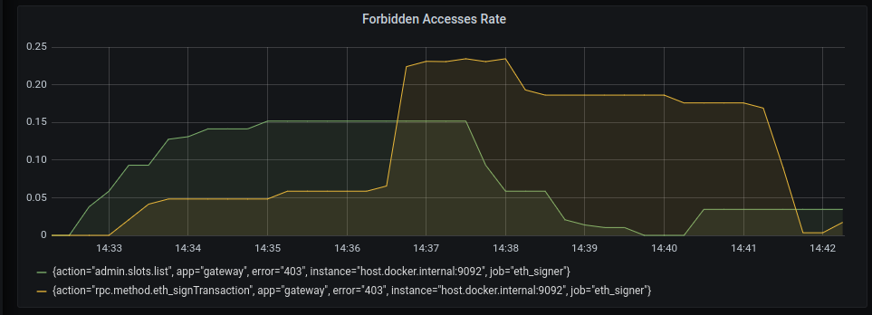

# Dashboard

The signare exposes [metrics](metrics.md) to monitor its state. In this document we present an example
dashboard with some of those metrics to provide enough data to determine if the signare is working properly.

The target audience of this document are signare operators.

## Panel documentation

This section documents every panel included as part of the dashboard (`dashboard.json` file in the current file's folder), and explains normal and bad behaviours that
can be identified by looking at them.

Each panel consumes one metric exposed by the signare, the [metrics](metrics.md) documentation can be 
reviewed for further information.

### Forbidden access attempts rate

This panel shows the rate of forbidden actions for a user's role within 5-minute intervals.

Monitoring the amount of unauthorized requests to an API it's important since these request might be an indication
of a potential security breach or attack.

The related metric is: `forbiden_access_count`.

## How should I monitor these metrics?

The best way to monitor a metric is to identify changes in its behaviour over time. For instance, given an operation . Those behaviour changes can be
throughput, the number of forbidden accesses for that operation growth can be easily spotted by monitoring 
the Grafana dashboard metrics.
