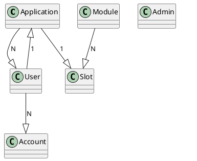

# Database reference

This document covers supported database technologies, authentication mechanisms, database schema and recommendations.

The target audience of this document are developers, system administrators and database administrators.

The application static configuration file options to connect to the database are out of scope of this document. Please, check [the configuration reference](./configuration.md){:target="_blank"} for details about the application static configuration.

## Supported database technologies

The application supports [PostgreSQL](https://www.postgresql.org/){:target="_blank"} as the database technology.

!!! note

    SQLite is also supported but just for testing purposes.

## Authentication mechanisms

User credentials (user and password) is the supported authentication mechanism for PostgreSQL. There are several password-based authentication methods in PostgreSQL, but ``scram-sha-256`` is the most secure one of them and therefore the one recommended to use. This configuration should be done on the server.

In addition to the above-mentioned authentication mechanism and even though it is a challenge-response scheme that prevents password sniffing on untrusted connections, the signare also supports SSL/TLS connections so that all the traffic between the client and the server is sent encrypted.

More precisely, the application supports the following SSL modes:

- **disable**: TLS mode is disabled.
- **require**: TLS mode is enabled, but no certificate validation is done.
- **verify-ca**: TLS mode is enabled, check the certificate chain up to a trusted certificate authority (CA).
- **verify-full**: TLS mode is enabled, check certificate chain and verify server host name matches its certificate. This is the most secure one.

The signare currently does not support custom locations for specifying the CA certificate, so if adding non-public or untrusted certificates, they must be installed to the operating system’s trusted chain. This is operating system specific.

## Encryption

The application stores the pin of each configured HSM slot in the database, so in addition to using a secure SSL mode for the connection between the application and the database server, we recommend using encryption at rest. Please, refer to the Data Partition Encryption section of PostgreSQL's encryption options [documentation](https://www.postgresql.org/docs/current/encryption-options.html){:target="_blank"}.

## Schema

The signare doesn't use database foreign keys. It's the application's logic that manages relations between tables/resources.

### Resources relations

In order to better understand the relationship between signare resources you can take a look at this diagram depicting them: 

<figure markdown="span">

  <figcaption>signare resources relationship diagram</figcaption>
</figure>

