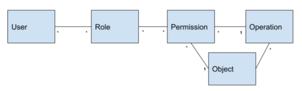

# Role Based Access Control Configuration 

This document provides an overview of the role base access control of the signare REST API, JSON RPC API and its configuration.

The target audience of this document are developers and system administrators interested in understanding and configuring authorization within the signare.

Out of the scope of this guide are explanations about the architecture of the application's security layer.

## Introduction

The signare API security model is  Role Based Access Control (**RBAC**) to manage user permissions. 
RBAC associates user with roles, and roles with a collection of actions to ensure that only a user with authorization can perform a given action, thus enhancing security
and simplifying permission management.

## Design pattern

The signare's RBAC follows the *eXtensible Access Control Markup Language* (**XACML**) framework.
XACML is a standardized language used for expressing and enforcing access control policies by enabling organizations to define fine-grained
access control rules, specifying who can access what resources under which conditions. The XACML model encourages the separation of the authorization process in: 

1. Enforcement (**PEP**)
2. Decision-making (**PDP**) 
3. Information retrieval (**PIP**).

Since the user is decoupled from the access decision, authorization policies can be updated on the fly and affect all users immediately.

### signare implementation

<figure markdown="span">
  
  <figcaption>signare RBAC implementation diagram</figcaption>
</figure>

#### Policy Enforcement Point  (**PEP**)

The HTTP middleware in the infrastructure layer defines the `Policy Enforcement Point (PEP)`.

#### Policy Decision Point (**PDP**)

The use case layer implements the `Policy Decision Point (PDP)`. The PDP validates if a given user has authorization to perform an action. 
The PDP depends on the `Policty Information Point (PIP)` to fetch the data it needs to authorize a user.

#### Policy Information Point (**PIP**)

The PDP defines a set of PIP ports that the output adapter layer implements to fetch data from different sources.

#### Model definition

The signare embeds YAML files to configure the RBAC. 
This means that the signare uses a static RBAC configuration, it loads every role, permission and action at start time, and it won't change in all the application's lifetime.

## How to configure RBAC

Our RBAC model consists of the following concepts:

1. **Actions**: specific operation that a role can perform within the system.
2. **Permissions**: groups a set of authorized actions.
3. **Roles**: points to one or more permissions based on the responsibilities of the different actors in the system.

<figure markdown="span">
  
  <figcaption>signare RBAC model diagram</figcaption>
</figure>

Three YAML files define the RBAC model, you can configure the RBAC as you wish by editing them. Let's dive into how to configure those files: 

### How to generate new actions

In the signare, each action corresponds to an API endpoint. 
A command in the ``/app`` directory of the signare project, automatically generates the action list corresponding to our [REST API](openapi-spec.md):

```console
make tools.generate 
``` 

The result of the `make tools.generate` command is outputted in `app/include/rbac/actions/generated.yaml`.

Below is an example of how a defined action looks:

```YAML
actions:
- "admin.applications.create"
```

Nevertheless, the application has a set of RPC methods in the API that are not defined in the API Spec that need to be manually added to ``/app/include/rbac/actions-manual.yaml``, again, one action per supported RPC method:

```YAML
actions:
  - rpc.method.eth_generateAccount
  - rpc.method.eth_removeAccount
  - rpc.method.eth_accounts
  - rpc.method.eth_signTransaction
```

### How to edit permissions

Move over to ``/app/include/rbac`` and by editing the file ``permissions.yaml`` you can remove, change or create new permissions by grouping actions like the example below: 

```YAML
  - id: allow-user-transaction-sign-actions
    description: Grants access to sign transactions
    actions:
      - rpc.method.eth_signTransaction
```

### How to edit roles

Having actions and permissions already defined, move to ``/app/include/rbac`` and by editing the file ``roles.yaml`` you can remove, change or create new roles with the chosen permissions
like in the example below: 

```yaml
roles:
  - id: signer-admin
    description: Administrator of the signare
    permissions:
      - allow-admin-actions
```

## How to use RBAC

Having understood how our RBAC model is implemented and configured, it is time to learn how it operates:

### User types

Users are the subjects of authorization checks. They can be created at two different levels: 

1. **Admins**: they are not related to any application, their only purpose with the default RBAC configuration is to be ``signer-admin``'s.
2. **Users**: they are created within an application. With the default configuration they cannot be ``signer-admin``'s.

### Default setup

The default RBAC configuration consists of the following roles and allowed actions per API type (REST and JSON RPC): 

| Name                   | User type | REST API resources that can be interacted with        | Allowed RPC API methods                              |
|------------------------|-----------|-------------------------------------------------------|------------------------------------------------------|
| **signer-admin**       | Admin     | Admins, Users, Accounts, Applications, Modules, Slots | ✗                                                    |
| **application-admin**  | User      | Users, Accounts                                       | eth_generateAccount, eth_removeAccount, eth_accounts |
| **transaction-signer** | User      | ✗                                                     | eth_signTransaction                                  |

### Transaction signing

One special case in our RBAC model is the access model configured for the ``eth_signTransaction`` RPC method. 
A request to sign a transaction has a `from` field that must be fulfilled with an ethereum address, this address must be enabled in the accounts' list of 
the user defined in the HTTP header of the request.
