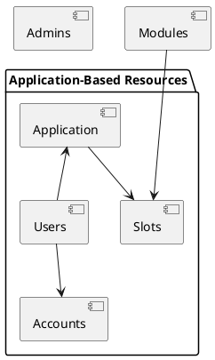

# How to configure a user 

This document explains how to create and properly configure different types of users in the signare. After reading this document, the reader will be able to create and configure all kinds of users.

The target audience of these documents are users that want to learn how to effectively utilize the application.

## Introduction

Before diving into how to create and configure users, it is important to understand how the resource hierarchy in the signare is defined:

<figure markdown="span">

  <figcaption>signare's resource hierarchy diagram</figcaption>
</figure>

As depicted in the above diagram, the signare defines two different kinds of users: 

1. **Admins**: they are not related to any application.
2. **Users**: they are created within an application.

!!! info
    You can check the [RBAC reference documentation](../reference/rbac.md) for more information on what these users can do with the default configuration. 

## Configuring admins

When you first bootstrap your signare instance, you need to configure the first system administrator with the ``--signer-administrator`` flag, 
for this guide we will assume that the value of that flag is ``owner``. 

Administrators in the signare can be created with the following API call: 

```code
curl --location --request POST 'http://localhost:32325/admin/users' \
--header 'X-Auth-UserId: owner' \
--header 'Content-Type: application/json' \
--data-raw '{
    "meta": {
        "id": "signer-admin"
    },
    "spec": {
        "description": "my admin"
    }
}
'
```
!!! info 
    You can only specify an optional ``id`` and an optional ``description`` for it. Admins do not specify their roles on creation since they all have the ``signer-admin`` role.

## Configuring users

### Creating a new user

As depicted in the introduction, users are application based resources meaning that they need to be created under an already existing application resource. 
When first creating a user, you must create an application using an **Admin** user, you can do so by calling the following API endpoint: 

```code
curl --location --request POST 'http://localhost:32325/applications' \
--header 'X-Auth-UserId: owner' \
--header 'Content-Type: application/json' \
--data-raw '{
    "meta": {
        "id": "application"
    },
    "spec": {
        "chainId": "44844",
        "description": "my application"
    }
}'
```

!!! info
    The only required attribute that you must specify is the ``chainId`` which should be the one from the blockchain that you are connecting to. 

With the application already created, we can now jump into the user creation. In this example, we will create a user with all the possible roles for users (in a default RBAC configuration): 

```code
curl --location --request POST 'http://localhost:32325/applications/application/users' \
--header 'X-Auth-UserId: owner' \
--header 'Content-Type: application/json' \
--data-raw '{
    "meta": {
        "id": "user-admin"
    },
    "spec": {
        "roles": [
            "application-admin"
        ],
        "description": "my user"
    }
}'
```

!!! info 
    The only required attributes that you must specify are the ``application`` under which the user will be created which is indicated through the path of the API call and the ``roles`` that the created user will have configured.

### Updating user information

Having created a user, one might want to edit its information afterwards. The user attributes that can be edited once created are their description and their roles. 
In order to update a user (or any other resource in fact) the signare needs its ``resource version`` alongside its ``id`` on the API call's path. 
The resource version is a unique random identifier that is updated each time a resource information gets persisted either on creation or on an update. 
The resource version is always included in the response so you either have it from the user creation or perform a describe call (http GET) to the resource you want to update in order to retrieve it. 

Once you have the resource version of your user, you can edit its information through the following API call: 

```code
curl --location --request PUT 'http://localhost:32325/applications/application/users/user-admin' \
--header 'X-Auth-UserId: user-admin' \
--header 'X-Auth-ApplicationId: application' \
--header 'Content-Type: application/json' \
--data-raw '{
    "meta": { 
        "resourceVersion": "0a840e4a-c174-4aa6-ace2-d6c29d59c394"
},
    "spec": {
        "roles": [
            "application-admin", "transaction-signer"
        ], 
        "description": "my user"
    }
}'
```
!!! info
    In case you want to add a new role to a user, you must specify all the desired roles in a comma separated list, not only the new one. 


