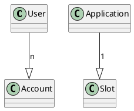

# How to create an account 

This document explains how to create and properly configure an Ethereum account in the signare. After reading this document, the reader will be able to create and configure a new account using the application.

The target audience of these documents are users that want to learn how to effectively utilize the application.

## Introduction

Each user within signare can have many accounts, generated through their application's configured HSM slot.
For more information on how to configure users, you can check our [How to configure users guide](how-to-configure-users.md).

<figure markdown="span">

  <figcaption>Users, Applications, Slots and Accounts relation diagram</figcaption>
</figure>

In order to generate new accounts using the signare, you must spin up the signer with a valid HSM, you can check our 
[Configuration reference guide](../reference/configuration.md) or follow the [Getting started guide](../getting-started/getting-started.md) until the 6th step.

## Creating a new module

Once you have the signare running with a valid HSM configured, you need to create a new module resource through the following API call: 

```code
curl --location --request POST 'http://localhost:32325/admin/modules' \
--header 'X-Auth-UserId: owner' \
--header 'Content-Type: application/json' \
--data-raw '{
    "meta": {
        "id": "hsm-soft-211"
    },
    "spec": {
        "configuration": {
            "hsmKind": "softHSM"
        },
        "description": "test hsm"
    }
}'
```

!!! info
    The ``hsmKind`` property has to contain the name of one of the supported HSM types since the configuration of the created HSM will be 
    read from the static configuration file. 

## Configuring a slot

Each application has to configure its own slot from a configured module in order for their users to be able to access the HSM functions.
You can configure a new slot on an application by creating a new slot pointing to your application with the following request: 

```code
curl --location --request POST 'http://localhost:32325/admin/modules/hsm-soft-211/slots' \
--header 'X-Auth-UserId: owner' \
--header 'Content-Type: application/json' \
--data-raw '{
    "meta": {
        "id": "test-slot"
    },
    "spec": {
        "applicationId": "application",
        "slot": "560778468",
        "pin": "userpin"
    }
}'
```

!!! info 
    Remember that the ``slot`` and ``pin`` attributes have to be valid values according to what has been setup in the desired HSM.


## Creating a new account

Accounts can be created through the following API call: 

```code
curl --location --request POST 'http://localhost:4545' \
--header 'X-Auth-UserId: test' \
--header 'X-Auth-ApplicationId: application' \
--header 'Content-Type: application/json' \
--data-raw '{
    "jsonrpc": "2.0",
    "method": "eth_generateAccount",
    "params": [],
    "id": 1
}'
```

!!! info
    Generating an account through this endpoint will only generate and store it in the HSM's slot. Follow the step in [Configuring an account on a user](#configuring-an-account-on-a-user) to be able to sign transactions with the newly generated account from an associated user.

## Configuring an account on a user

In order to persist the account in the database and associate it to a user, so they can use it to sign transactions,
you can make the following call to the signare's API:

```code
curl --location --request POST 'http://localhost:32325/applications/application/users/user-admin/accounts' \
--header 'X-Auth-UserId: user-admin' \
--header 'X-Auth-ApplicationId: application' \
--header 'Content-Type: application/json' \
--data-raw '{ 
    "spec": {
        "accounts": [
            "0xa2c16184fA76cD6D16685900292683dF905e4Bf2"
        ]
    }
}'
```

!!! info
    Remember that the ``account`` has to exist within the HSM or else the request will fail.
